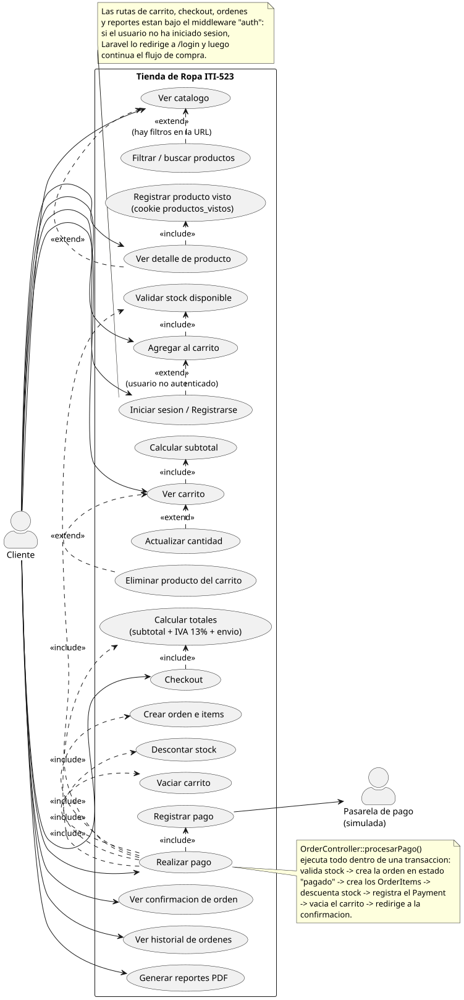
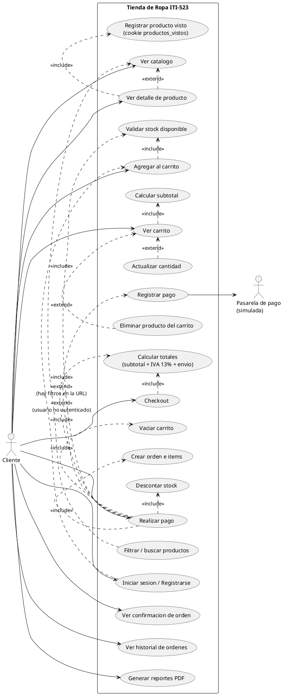
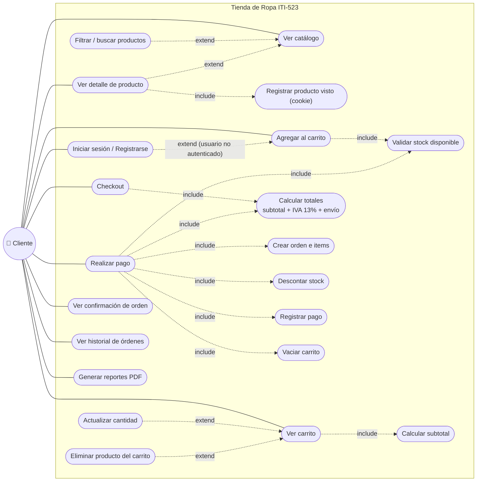

# Diagrama de caso de uso — Proceso de compra

Tienda de Ropa ITI-523 · Laravel 13 + Blade + Tailwind

Este diagrama **no es genérico**: cada caso de uso corresponde a una ruta real de
`routes/web.php` y a un método concreto de `CartController`, `OrderController`,
`ProductController` o `ReportController`.

> Archivos del diagrama: [`diagrama-caso-uso-compra.puml`](diagrama-caso-uso-compra.puml)
> (fuente PlantUML), [`diagrama-caso-uso-compra.svg`](diagrama-caso-uso-compra.svg) y
> [`diagrama-caso-uso-compra.png`](diagrama-caso-uso-compra.png) (renderizados).
> Para regenerarlos: `java -jar plantuml.jar -Playout=smetana -tsvg docs/diagrama-caso-uso-compra.puml`

---

## 1. Actores

| Actor | Descripción |
|---|---|
| **Cliente** | Usuario de la tienda. Navega el catálogo sin autenticarse; para comprar necesita una cuenta (middleware `auth`). |
| **Pasarela de pago (simulada)** | Actor secundario. El proyecto **no** integra una pasarela real: `OrderController::procesarPago()` crea un registro `Payment` con estado `aprobado` y una referencia `TXN-XXXXXXXXXXXX` generada localmente. |

## 2. Casos de uso y su origen en el código

| Caso de uso | Ruta | Controlador |
|---|---|---|
| Ver catálogo | `GET /productos` | `ProductController@index` |
| Filtrar / buscar productos | `GET /productos?categoria=&buscar=&precio_min=&precio_max=` | `ProductController@index` |
| Registrar producto visto | (middleware, solo en `productos.show`) | `App\Http\Middleware\ProductosVistos` (cookie `productos_vistos`, últimos 5, 30 días) |
| Mostrar vistos recientemente (bloque del catálogo) | `GET /productos` | `ProductController@index` lee la cookie `productos_vistos` |
| Ver detalle de producto | `GET /productos/{slug}` | `ProductController@show` |
| Iniciar sesión / Registrarse | `GET\|POST /login`, `GET\|POST /register` | `Auth\AuthenticatedSessionController`, `Auth\RegisteredUserController` |
| Agregar al carrito | `POST /carrito/agregar` | `CartController@agregar` |
| Validar stock disponible | — | `CartController@agregar` y `OrderController@procesarPago` |
| Ver carrito | `GET /carrito` | `CartController@index` |
| Calcular subtotal | — | `CartController@index` |
| Actualizar cantidad | `PATCH /carrito/{cartItem}` | `CartController@actualizar` |
| Eliminar producto del carrito | `DELETE /carrito/{cartItem}` | `CartController@eliminar` |
| Checkout | `GET /checkout` | `OrderController@checkout` |
| Calcular totales | — | `OrderController@checkout` y `@procesarPago` |
| Realizar pago | `POST /checkout/procesar` | `OrderController@procesarPago` |
| Crear orden e items | — | `OrderController@procesarPago` (dentro de `DB::transaction`) |
| Descontar stock | — | `OrderController@procesarPago` |
| Registrar pago | — | `OrderController@procesarPago` |
| Vaciar carrito | — | `OrderController@procesarPago` |
| Ver confirmación de orden | `GET /ordenes/{order}/confirmacion` | `OrderController@confirmacion` |
| Ver historial de órdenes | `GET /ordenes` | `OrderController@historial` |
| Generar reportes PDF | `GET /reportes/ventas-por-mes`, `GET /reportes/ventas-por-cliente` | `ReportController` |

## 3. Justificación de las relaciones

### `<<include>>` — pasos que **siempre** ocurren

| Relación | Por qué |
|---|---|
| `Ver detalle de producto` ──▷ `Registrar producto visto` | El middleware `ProductosVistos` solo escribe la cookie cuando la ruta es `productos.show`, y lo hace siempre que se abre una ficha. |
| `Agregar al carrito` ──▷ `Validar stock disponible` | `agregar()` compara `$variante->stock` contra la cantidad pedida **antes** de crear el `CartItem`. |
| `Ver carrito` ──▷ `Calcular subtotal` | `index()` siempre suma `cantidad × precio` de cada línea. |
| `Checkout` ──▷ `Calcular totales` | `checkout()` siempre calcula subtotal + IVA 13 % + envío ₡2 500. |
| `Realizar pago` ──▷ `Validar stock`, `Calcular totales`, `Crear orden e items`, `Descontar stock`, `Registrar pago`, `Vaciar carrito` | Son los seis pasos obligatorios del `DB::transaction()` de `procesarPago()`; si uno falla se revierte todo. |

### `<<extend>>` — pasos **condicionales**

| Relación | Condición real en el código |
|---|---|
| `Filtrar / buscar productos` ──▷ `Ver catálogo` | Solo si llegan `categoria`, `buscar`, `precio_min` o `precio_max` (`$request->filled(...)`). |
| `Ver detalle de producto` ──▷ `Ver catálogo` | El cliente puede comprar desde el listado sin abrir la ficha. |
| `Actualizar cantidad` / `Eliminar producto` ──▷ `Ver carrito` | Acciones opcionales que se lanzan desde la vista del carrito. |
| `Iniciar sesión / Registrarse` ──▷ `Agregar al carrito` | Extiende el flujo **solo si el usuario no está autenticado**: el middleware `auth` lo desvía a `/login` y luego retoma la compra. |

> **Nota sobre autenticación:** carrito, checkout, órdenes y reportes viven dentro de
> `Route::middleware('auth')` en `routes/web.php`. Por eso el login se modela como `<<extend>>`
> (ocurre solo si hace falta) y no como `<<include>>`.

## 4. Flujo principal (camino feliz)

1. `GET /productos` — el cliente ve el catálogo, opcionalmente filtra.
2. `GET /productos/{slug}` — abre la ficha y elige talla/color (una `ProductVariant`).
3. `POST /carrito/agregar` — si no hay sesión, Laravel redirige a `/login`; luego se valida stock y se crea/incrementa el `CartItem`.
4. `GET /carrito` — revisa líneas y subtotal; puede actualizar cantidades o eliminar líneas.
5. `GET /checkout` — se muestran subtotal, IVA (13 %), envío (₡2 500) y total.
6. `POST /checkout/procesar` — con `metodo_pago` ∈ {`tarjeta`, `paypal`}: se revalida stock, se crea la `Order` en estado **`pagado`**, sus `OrderItem` con el precio unitario del momento, se descuenta stock, se registra el `Payment` aprobado y se vacía el carrito.
7. `GET /ordenes/{order}/confirmacion` — se muestra el número de seguimiento `ORD-XXXXXXXXXX` (solo al dueño de la orden; si no, `403`).

**Flujos alternativos**

- Carrito vacío en el paso 5 o 6 → redirige a `/carrito` con mensaje de error.
- Stock insuficiente en el paso 3 o 6 → vuelve atrás con error y **no** se crea nada.
- `metodo_pago` inválido → error de validación, sin orden.
- Orden de otro usuario en el paso 7 → `403 Forbidden`.

Todos estos flujos están cubiertos por las pruebas de `tests/Feature/CheckoutOrderTest.php`
y `tests/Feature/CartControllerTest.php`.

---

## 5. Fuente PlantUML

## 6. Versión Mermaid (se renderiza directo en GitHub)

Mermaid no tiene diagrama de casos de uso UML, así que se aproxima con un grafo:
elipses = casos de uso, línea sólida = asociación del actor, línea punteada = `<<include>>` / `<<extend>>`.

